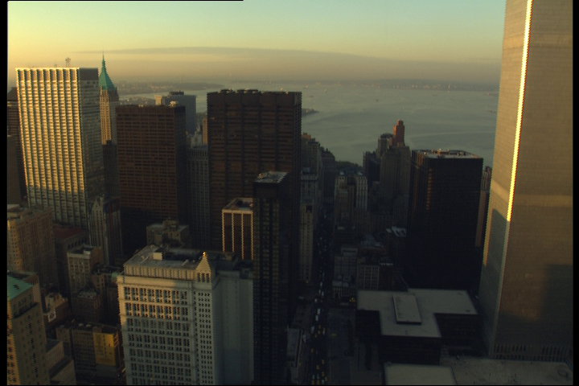
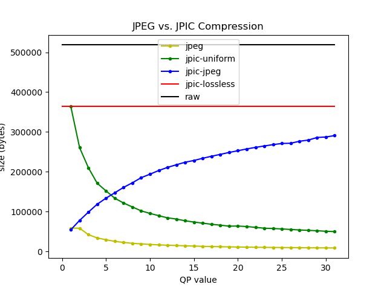
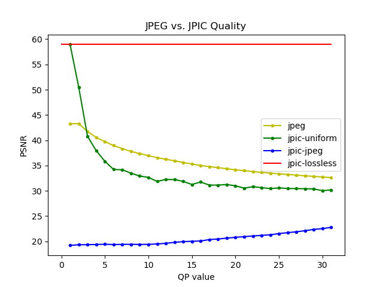
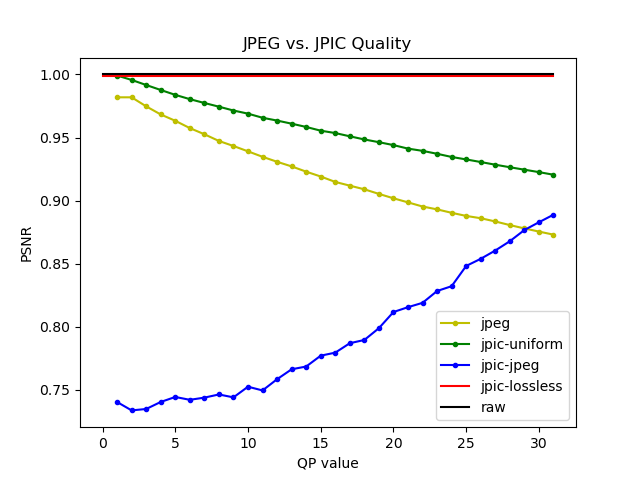
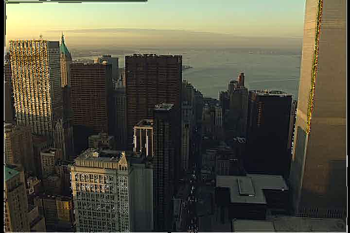
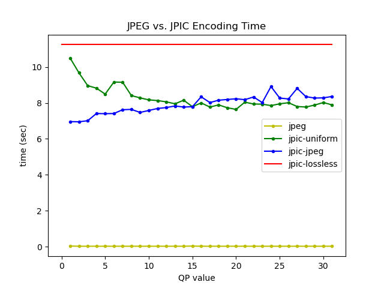
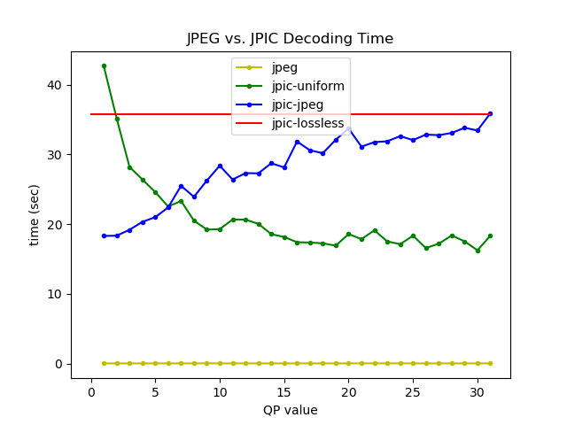

# jpic: Learning Image Compression Using Python

`jpic` is a script that compresses images using traditional encoding tools, such as DCT/IDCT (Discrete Cosine Transform / Inverse Discrete Cosine Transform) transforms, quantization, zig-zag scanning, Huffman coding, and RLE (Run-Lenght Encoding).

Main goal of jpic is to help learning the operational issues related to encoding images, and allow quick experimentation.

Non-goals include:
* performance: It is really bad (encoding time takes up to 10 seconds for a 720x480 image, compared to ~20 ms for a vanilla JPEG library).
* standards conformance: We wrote our own format for simple packing encoding tables and encoding bits. This format does bad things (like using [pickle](https://docs.python.org/3/library/pickle.html) to serialize an encoding table), just so we can have something working fast).


# 1. Operation

`jpic` provides a series of python scripts. It requires python3 with numpy installed.

## 1.1. Install jpic

Just clone the repo:

```
$ git clone https://github.com/chemag/jpic
$ cd jpic
$ ./jpic.py --help
usage: jpic.py [-h] [-d] [--quiet] [--width WIDTH] [--height HEIGHT]
               [--video_size VIDEO_SIZE] [--framenum FRAMENUM]
               [-Q quantization] [-E] [-D] [-P] [--dump-input dump_input]
               [--dump-pgm dump_pgm]
               function input-file [output-file]

dctlib.

positional arguments:
  function              function (['encode', 'decode', 'parse'])
  input-file            input file
  output-file           output file

optional arguments:
  -h, --help            show this help message and exit
  -d, --debug           Increase verbosity (use multiple times for more)
  --quiet               Zero verbosity
  --width WIDTH         use WIDTH width (default: 720)
  --height HEIGHT       HEIGHT height (default: 480)
  --video_size VIDEO_SIZE
                        use <width>x<height>
  --framenum FRAMENUM   FRAMENUM (default: 0)
  -Q quantization, --quantization quantization
                        quantization (['lossless', 'jpeg-0', 'jpeg-1',
                        'jpeg-2', 'jpeg-3', 'jpeg-4', 'jpeg-5', 'jpeg-6',
                        'jpeg-7', 'jpeg-8', 'jpeg-9', 'jpeg-10', 'jpeg-11',
                        'jpeg-12', 'jpeg-13', 'jpeg-14', 'jpeg-15', 'jpeg-16',
                        'jpeg-17', 'jpeg-18', 'jpeg-19', 'jpeg-20', 'jpeg-21',
                        'jpeg-22', 'jpeg-23', 'jpeg-24', 'jpeg-25', 'jpeg-26',
                        'jpeg-27', 'jpeg-28', 'jpeg-29', 'jpeg-30', 'jpeg-31',
                        'uniform-0', 'uniform-1', 'uniform-2', 'uniform-3',
                        'uniform-4', 'uniform-5', 'uniform-6', 'uniform-7',
                        'uniform-8', 'uniform-9', 'uniform-10', 'uniform-11',
                        'uniform-12', 'uniform-13', 'uniform-14',
                        'uniform-15', 'uniform-16', 'uniform-17',
                        'uniform-18', 'uniform-19', 'uniform-20',
                        'uniform-21', 'uniform-22', 'uniform-23',
                        'uniform-24', 'uniform-25', 'uniform-26',
                        'uniform-27', 'uniform-28', 'uniform-29',
                        'uniform-30', 'uniform-31'])
  -E, --encode          Encode file
  -D, --decode          Decode file
  -P, --parse           Parse file
  --dump-input dump_input
                        dump_input
  --dump-pgm dump_pgm   dump_pgm
```


## 1.2. Encode a file

```
$ ./jpic.py encode <src>.raw <dst>.jpic
```

Where:
* `<src>.raw`: source file. Must be in raw YCbCr 4:2:0 format.
* `<dst>.jpic`: destination file. Will use the proprietary jpic format.

Optional parameters:
* `--frame <framenum>`: optional frame number. This allows using .yuv (raw YCbCr 4:2:0) video files as source files by letting you choose the frame number.
* `-w <width>`: source file width (in pixels)
* `-h <height>`: source file height (in pixels)
* `-Q <quantization>`: quantization mechanism. Currently we support "lossless" (no quantization), "uniform-<val>" (uniform quantization, using a matrix with all the values set to "<val>"), and "jpeg-<val>" (matrix-based quantization, using a version of the JPEG matrices scaled down using "<val>").

Example:

```
$ ./jpic.py encode src14_frame0.raw /tmp/foo.jpic
```

## 1.3. Decode a file

```
$ ./jpic.py decode <src>.jpic <dst>.raw
```

Where:
* `<src>.jpic`: source file. Must be in the proprietary jpic format.
* `<dst>.raw`: destination file. Will be in raw YCbCr 4:2:0 format.

You can convert the raw file into a displayable format using ffmpeg:

```
$ ffmpeg -y -f rawvideo -pixel_format yuv420p -s 720x480 -i src14_frame0.raw src14_frame0.raw.png
```

Example:

```
$ ./jpic.py decode /tmp/foo.jpic /tmp/foo.jpic.raw
$ ffmpeg -y -f rawvideo -pixel_format yuv420p -s 720x480 - /tmp/foo.jpic.raw src14_frame0.raw.jpic.raw.png
```



Figure 1 shows the image after being encoded and decoded using jpic.


## 1.4. Parse a JPIC file

```
$ ./jpic.py parse <src>.jpic
```

Where:
* `<src>.jpic`: source file. Must be in the proprietary jpic format.

Script will return information about the JPIC file.

Example:

```
$ ./jpic.py parse /tmp/foo.jpic    
{'color': 'yuv', 'width': '720', 'height': '480', 'transform': 'dct', 'quantization': 'lossless', 'zigzag': 'basic', 'encoding': 'basic'}
[['jpic', 4], ['desc', 110], ['ytbl', 52229], ['utbl', 18584], ['vtbl', 15023], ['plny', 209842], ['plnu', 34786], ['plnv', 33346]]
```

This is a YUV image (720x480). Encoding transform is DCT, and quantization type is "lossless". Zig-zag mechanism is "basic", and encoding mechanism is also "basic". The sizes of the different parts of the file include 52229, 18584, and 15023 bits the Y, Cb, and Cr encoding tables, and 209842, 34786, and 33346 bits for the Y, Cb, and Cr encoding bitstrings.


# 2. Code Description

The code includes the following python files:

* `utils.py`: Script implementing some file read/write utilities, including a raw binary reader, and a couple of writers (raw and PGM).
* `dctlib.py`: Script implementing DCT and IDCT transforms (both 1D and 2D). It includes a unittest file (`dctlib_unittest.py`).
* `huffman.py`: Script implementing a Huffman coding calculator.
* `jpiclib.py`: Script implementing the remaining codec tools (quantization, zig-zag scanning, run-length-encoding) and jpic serialization.
* `jpic.py`: Main script implementing the proprietary JPIC image format.

We also provide shell scripts to help create the results in the following Section. Figure creation requires installing the [plotty](https://github.com/chemag/plotty) tool.


# 3. Results

## 3.1. Compression and Quality



Figure 2 shows the compression of each of the 3 quantization approaches (lossless, uniform, and JPEG-matrix). We add a vanilla JPEG encoder (yellow line) for comparison purposes, and the original image file size (black line). Note that the lossless and raw values do not have a QP value (we just draw a horizontal line). Sizes with uniform quantization go down with increasing QP values, as the QP value is used as a multiplication factor for the values of the quantization matrix. Sizes with jpic-jpeg quantization go up with increasing QP values, as the QP value is used as a division factor for the values of the original JPEG quantization matrix.




Figure 3 shows the quality of the different approaches, measured using PSNR. 




Figure 4 shows the quality of the different approaches, measured using SSIM. 


## 3.2. Discussion

JPIC is definitely worse than JPEG both in terms of quality and compression rates.

Some notes:

* We can see the effect of quantization in both size and quality: The 2 QP-based approaches (uniform and original JPEG matrix) show the effect of the quantization values: Higher values mean more information is lost (less quality), which implies better compression rates.

* When comparing vanilla jpeg vs. JPIC with uniform quantization, PSNR gives better scores to jpeg, while SSIM gives better scores to JPIC-uniform.

* There is some interesting encoding effect when using the JPEG matrix quantization matrix in JPIC (low QP values, i.e., using the actual JPEG matrix). We are not sure whether this is a bug or a byproduct of using large quantization values.



Figure 5 shows the effect of compressing and decompressing the original image using the jpeg-1 quantization mechanism (this means the original JPEG quantization matrix). Note the white dots around high-frequency components.


## 3.3. Complexity




Figures 6 and 7 show the cost of the JPIC encoder.

Not much to state here, but that JPIC does not care about performance. There is a lot of headroom for optimization and profiling here, but we do not want to sacrifice readability (this is a learning tool).


# 4. Implementation Notes

Both encoder and decoder use floats from the beginning to the end, and only move to integers when they need to go to the Huffman encoding step.

In the complexity Section, we can see that decoding is significantly more expensive than encoding (3x to 4x). This is likely explained by our mechanism to decode bits into symbolbeing quite naive: We read a bit, and check whether it is in the decoding table. If not, we read another bit, and try again. There are definitely data structures more appropriate for this purpose.


# 5. Future Work

Some ideas to get better:

* (1) use pre-defined encoding tables. Right now we are calculating the optimal (Huffman encoding) table for each plane (luma and 2 chromas), and sending the full table. The size of each encoding tables varies between 10 and 50 kbits. We could instead pre-define the encoding table (matching symbols to actual values). Tradeoff will be slightly bigger planes due to non-optimal Huffman encoding.
* (2) encode DC component as a diff of the previous one(s). Right now we use 16 bits (2 bytes) for each DC component, which means a minimum of 10.8 kB just for this component. We should explore encoding it as a diff from the previous one, using some entropy encoding algo.
* (3) add unittests.


# Appendix 1: The JPIC Image Format

The JPIC image format is a simple TLV (tag, length, value) format that allows simple serialization to a file in the encoder side, and unserialization from a file in the decoder side. The TLV format is as follows:

* tag: always 4 bytes
* length: always 4 bytes. Value must be read in network order, and represents the length of the value *in bits* (which allows dumping generic bitstrings)
* value: the value (length is <length> in bits). Tag dependent.

File always starts with a 4-byte magic word ("jpic").

Some well-known tags:

* "desc": JPIC file description (text format)
* "ytbl": Y (luminance) encoding table. This is a python struct (a dictionary, if you are curious), serialized using pickle.
* "utbl": Cb (blue chroma) encoding table.
* "vtbl": Cr (red chroma) encoding table.
* "plny": Y (luminance) bits. This is a python bitstring.
* "plnu": Cb (blue chroma) bits. This is a python bitstring.
* "plnv": Cr (red chroma) bits. This is a python bitstring.


# Appendix 2: Coordinate Operation in Numpy

Matrix shapes in numpy are always <height>x<width>.

Coordinates are always [i, j], where i is the height and j is the width,
starting at the top-left part of the matrix, and moving down and right.

```
0,0  <--------------------------- width ------------------------>
  |  +--------------------------- ... --------------------------+ ^
  |  |                            ...                           | |
  |  +--------------------------- ... --------------------------+ |
  |  |                            ...                           | |
  |  +--------------------------- ... --------------------------+ |
  |  |                            ...                           | |
  |  +--------------------------- ... --------------------------+ |
i v -|------------------> j       ...                           | | height
     +--------------------------- ... --------------------------+ |
     |                            ...                           | |
     +--------------------------- ... --------------------------+ |
     ...                                                          |
     +--------------------------- ... --------------------------+ |
     |                            ...                           | |
     +--------------------------- ... --------------------------+ v
```

Figure XXX shows an example of accessing element [i, j] in a numpy matrix,
where `i` is the height and `j` is the width.

